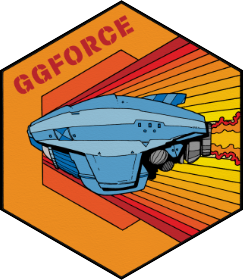

<!-- README.md is generated from README.Rmd. Please edit that file -->

```{r, include = FALSE}
knitr::opts_chunk$set(
  collapse = TRUE,
  comment = "#>",
  fig.path = "man/figures/README-",
  out.width = "100%"
)
```
# ggforce 

<!-- badges: start -->
[](https://github.com/thomasp85/ggforce/actions)
[](https://CRAN.R-project.org/package=ggforce)
[](https://CRAN.R-project.org/package=ggforce)
<!-- badges: end -->

*Accelerating ggplot2*

`ggforce` is a package aimed at providing missing functionality to `ggplot2` 
through the extension system introduced with `ggplot2` v2.0.0. Broadly speaking 
`ggplot2` has been aimed primarily at explorative data visualization in order to 
investigate the data at hand, and less at providing utilities for composing 
custom plots a la [D3.js](https://d3js.org). `ggforce` is mainly an attempt to 
address these "shortcoming" (design choices might be a better description). The 
goal is to provide a repository of geoms, stats, etc. that are as well 
documented and implemented as the official ones found in `ggplot2`.

## Installation

You can install the released version of ggforce from [CRAN](https://CRAN.R-project.org) with:

``` r
install.packages("ggforce")
```

And the development version from [GitHub](https://github.com/) with:

``` r
# install.packages("devtools")
devtools::install_github("thomasp85/ggforce")
```

## Features
`ggforce` is by design a collection of features with the only commonality being
their tie to the `ggplot2` API. Because of this an overview of all features 
would get too long for a README. The package has a [website](https://ggforce.data-imaginist.com)
where every feature is described and justified with examples and plots. There
should be a plot in the README of a visualization package though, so without 
further ado:

```{r example}
library(ggforce)
ggplot(iris, aes(Petal.Length, Petal.Width, colour = Species)) +
  geom_point() +
  facet_zoom(x = Species == "versicolor")
```

## Code of Conduct
Please note that the 'ggforce' project is released with a
[Contributor Code of Conduct](https://ggforce.data-imaginist.com/CODE_OF_CONDUCT.html).
By contributing to this project, you agree to abide by its terms.
